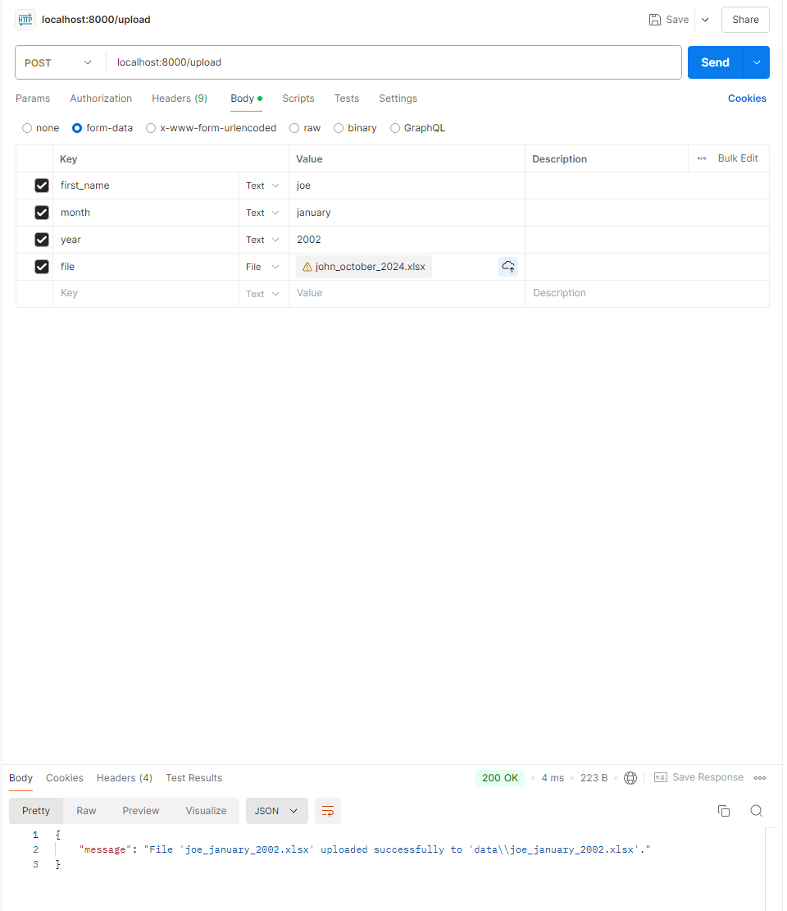
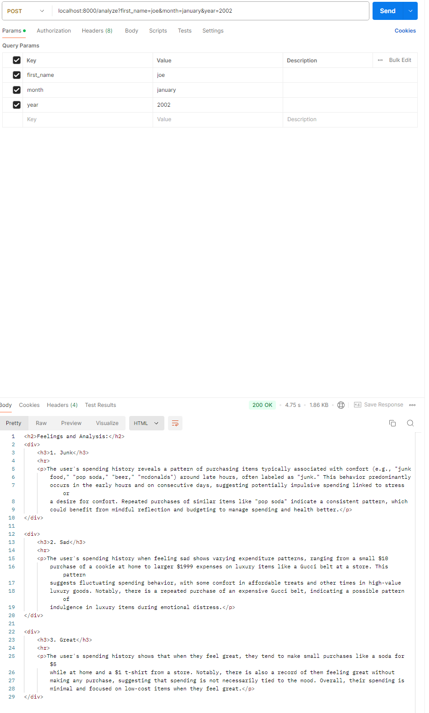

## How to run

### Step 0. Create key.json file in root directory, and contents should be the openapi key
```
{"key": "OPENAI Key"}
```

### Pip install any package you need, then run below command
```
uvicorn app:app --reload
```


## How to use. example data is given: first_name: johndoe, month:october, year:2024

### 1. POST file with first_name, month, year to localhost:8000/upload route


### 2. Analyze uploaded file with POST request to localhost:8000/analyze with query parameters being first_name, month, year. Same names as in step 1
