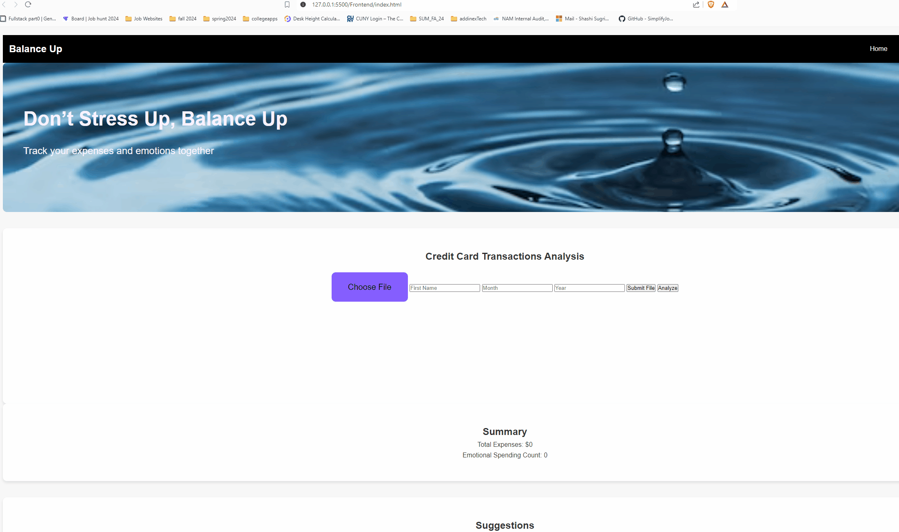

Analyze credit card transactions excel file by day
Analyze journal entries by day

## To Run

### 1. Start the backend. 
- Go to the backend folder and see README

### 2. Start frontend, index.html

### 3. Submit a file, and with the same name, month, year, click analyze and wait

